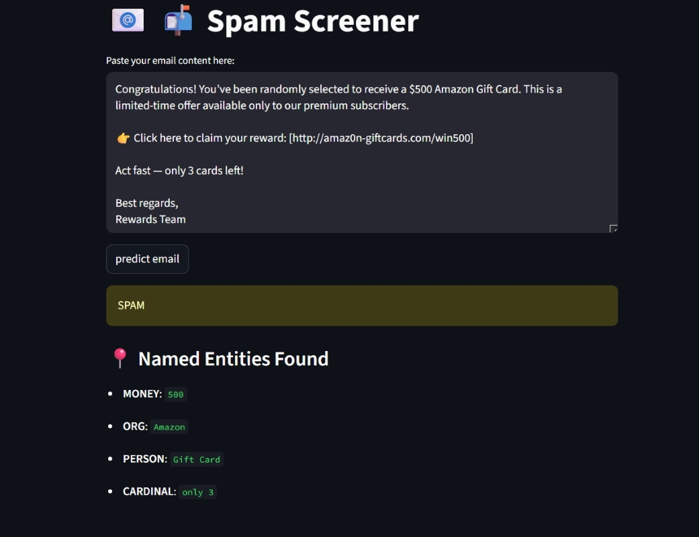
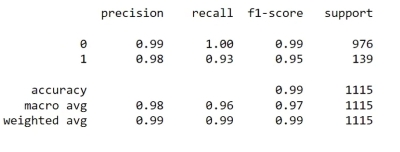

# 📬 Spam Screener

SpamScreener is a lightweight NLP app that classifies email content as **SPAM** or **HAM** using a scikit-learn . Designed for fast predictions and easy integration into email workflows.

---

## 🚀 Overview

- 🔍 Input: Raw email text
- 🎯 Output: `SPAM` or `HAM`
- 🧠 Model: scikit-learn pipeline (BOW(CountVectorizer()) + classifier(MultinomialNB()))
- 📊 Accuracy: 99%

---
### 📸 Demo

  

---
## 📖 Scenario

Support teams often face inbox overload. SpamScreener flags spam instantly, helping teams focus on real customer queries.

---

## 💼 Business Impact

- 🛡️ Reduces phishing risk  
- ⏱️ Saves manual filtering time  
- 🔗 Integrates into email systems

---
🛠️ Tech Stack
🐍 Python

📚 scikit-learn

🧪 pandas, NumPy

💬 NLP preprocessing (tokenization, stopword removal, TF-IDF)

🌐 Streamlit (UI)

---
## 📦 Dataset

- 📄 Total Emails: 5,572  
- 🎯 Labels: `spam`, `ham`

---
## 📈 Model Performance
 

---
## 🧪 How It Works
User submits email content

Text is cleaned and vectorized

Model predicts label

Result displayed as SPAM or HAM

---

# Install dependencies
```  bash
    pip install -r requirements.txt
   ```

# Run the app
```   bash
    streamlit run app.py
   ```
